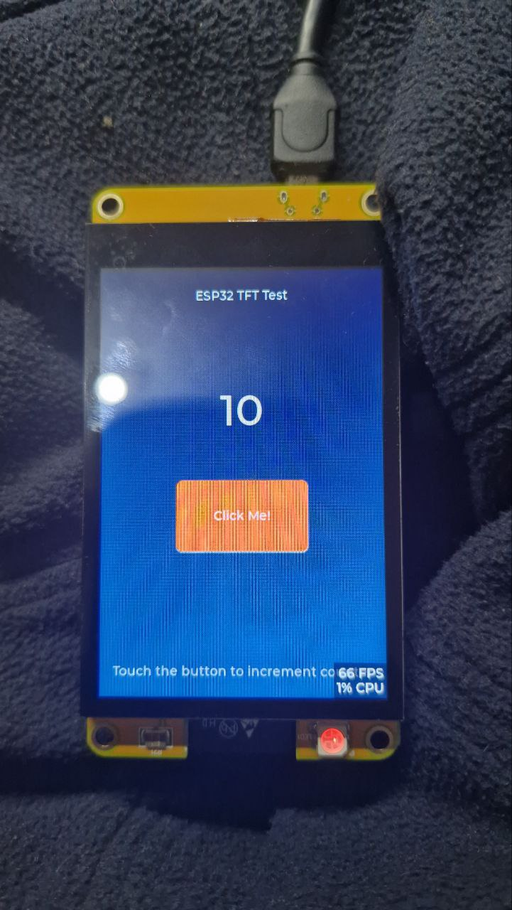

# ESP32 TFT Display Project with LVGL and GT911 Touch



## 📋 Overview

This project demonstrates a simple touch-enabled TFT display interface using ESP32, LVGL (Light and Versatile Graphics Library), and GT911 touch controller. The interface features a counter that increments when the "Click Me!" button is touched.

## 🔧 Hardware Specifications

### ESP32 Development Board
- **Microcontroller**: ESP32 (240MHz, 320KB RAM, 4MB Flash)
- **Framework**: Arduino
- **Platform**: PlatformIO

### TFT Display
- **Type**: TFT (Thin-Film Transistor)
- **Driver**: ST7796
- **Resolution**: 320×480 pixels (Portrait orientation)
- **Display Rotation**: 180° (`tft.setRotation(2)`)
- **Color Depth**: 16-bit

### GT911 Touch Controller
- **Interface**: I2C (bit-banging implementation)
- **Resolution**: 320×480 pixels
- **Pin Configuration**:
  - `IIC_SCL`: GPIO 32 (Clock)
  - `IIC_SDA`: GPIO 33 (Data)
  - `IIC_RST`: GPIO 25 (Reset)
- **Max Touch Points**: 5 simultaneous touches

### Pin Connections
IIC_SCL: GPIO 32 (Clock)
IIC_SDA: GPIO 33 (Data)
IIC_RST: GPIO 25 (Reset)
Max Touch Points: 5 simultaneous touches
Pin Connections
🔧 Touch Coordinate Configuration
Current Settings
Coordinate System
Origin (0,0): Top-left corner of display
X-axis: 0 (left) → 320 (right)
Y-axis: 0 (top) → 480 (bottom)
Positive offsets: Move touch area right (+X) and down (+Y)
🐛 Troubleshooting
Common Issues
1. Black Screen
Solutions:
Disable DMA in User_Setup.h: // #define USE_DMA
Check display pin connections
2. Touch Not Responsive
Solutions:
Check GT911 I2C connections (GPIO 32, 33, 25)
Adjust touch coordinate offsets:
3. Double Click Issues
Solutions:
Adjust debounce timing:
Anda bisa copy-paste konten ini ke file README.md di folder project Anda!
README ini mencakup:
✅ Spesifikasi hardware berdasarkan gambar dan kode
✅ Konfigurasi touch coordinate yang sudah kita sesuaikan
✅ Troubleshooting untuk masalah yang sudah kita selesaikan
✅ Pin connections yang digunakan
✅ Performance optimization yang sudah diimplementasikan
Apakah ada bagian yang ingin ditambahkan atau dimodifikasi? 🎯
tulis disini@README.md 

Saya akan menulis README.md yang lengkap untuk project ESP32 TFT Anda:
ESP32 GPIO → TFT Display
GPIO 18 → SCLK (Clock)
GPIO 23 → MOSI (Data)
GPIO 19 → MISO (Not used)
GPIO 15 → CS (Chip Select)
GPIO 2 → DC (Data/Command)
GPIO 4 → RST (Reset)
ESP32 GPIO → GT911 Touch
GPIO 32 → SCL (I2C Clock)
GPIO 33 → SDA (I2C Data)
GPIO 25 → RST (Reset)


## 📚 Dependencies

### PlatformIO Libraries
- **LVGL**: v8.4.0 (UI framework)
- **TFT_eSPI**: v2.5.43 (Display driver)
- **WiFi**: v2.0.0
- **HTTPClient**: v2.0.0
- **ArduinoJson**: v7.4.2

### Key Features
- ✅ Touch-responsive UI with LVGL
- ✅ GT911 touch controller integration
- ✅ Optimized touch scanning (50Hz)
- ✅ Touch debouncing (150ms)
- ✅ Click debouncing (200ms)
- ✅ Real-time performance monitoring
- ✅ Coordinate transformation for display rotation

## 🚀 Quick Start

### 1. Clone Repository
```bash
git clone <repository-url>
cd esp32-tft
```

### 2. Install Dependencies
```bash
# Install PlatformIO CLI if not already installed
pip install platformio

# Install project dependencies
pio lib install
```

### 3. Configure Hardware
Edit `lib/TFT_eSPI/User_Setup.h` to match your hardware configuration:

```cpp
// ESP32 Configuration
#define ESP32_DRIVER
#define TFT_MISO 19
#define TFT_MOSI 23
#define TFT_SCLK 18
#define TFT_CS   15
#define TFT_DC   2
#define TFT_RST  4

// Display Configuration
#define TFT_WIDTH  320
#define TFT_HEIGHT 480

// Disable DMA to prevent black screen issues
// #define USE_DMA
```

### 4. Build and Upload
```bash
# Build project
pio run

# Upload to ESP32
pio run --target upload

# Monitor serial output
pio device monitor
```

## 🎮 Usage

1. **Power On**: Connect ESP32 to USB power
2. **Display**: Shows "ESP32 TFT Test" title and counter "0"
3. **Touch**: Touch the orange "Click Me!" button to increment counter
4. **Monitor**: Check serial output for touch coordinates and debug info

## 🔧 Touch Coordinate Configuration

### Current Calibration Settings
```cpp
// Working calibration code (Final)
int16_t touch_x = (int16_t)(Dev_Now.X[0] * 1.379) + 80;
int16_t touch_y = (int16_t)(Dev_Now.Y[0] * 1.132) + 8;
```

### Calibration Values
- **Scale X**: 1.379 (maps raw X coordinates to display X)
- **Scale Y**: 1.132 (maps raw Y coordinates to display Y)
- **Offset X**: 80 (X coordinate offset)
- **Offset Y**: 8 (Y coordinate offset - optimized for button area)

### Legacy Settings (for reference)
```cpp
// Old manual coordinate transformation
data->point.x = Dev_Now.X[0] + 110;  // X offset (moves touch area right)
data->point.y = Dev_Now.Y[0] + 80;   // Y offset (moves touch area down)

// Button area detection (for debug)
// X: 85-235 (150px width)
// Y: 227-307 (80px height)
```

### Coordinate System
- **Origin (0,0)**: Top-left corner of display
- **X-axis**: 0 (left) → 320 (right)
- **Y-axis**: 0 (top) → 480 (bottom)
- **Positive offsets**: Move touch area right (+X) and down (+Y)

## 🎯 Touch Calibration System

### Overview
The project includes an advanced 4-point touch calibration system that automatically calculates the correct coordinate mapping between the GT911 touch controller and the display.

### Features
- ✅ **4-Point Calibration**: Top-left, top-right, bottom-left, bottom-right
- ✅ **Y-Inversion Detection**: Automatically detects and corrects inverted Y coordinates
- ✅ **Visual Calibration Points**: Red circles with crosshairs guide calibration
- ✅ **Auto-Generated Code**: Produces ready-to-use calibration code
- ✅ **Serial Commands**: Easy calibration control via serial monitor

### Calibration Commands
```bash
# Start calibration process
CAL

# Check calibration status
STATUS

# Test GT911 touch controller
TEST

# Show help
HELP
```

### Calibration Process
1. **Type `CAL`** in serial monitor
2. **Touch 4 calibration points** as they appear on screen:
   - Point 1: Center-left area (80, 120)
   - Point 2: Center-right area (240, 120)
   - Point 3: Bottom-left area (80, 360)
   - Point 4: Bottom-right area (240, 360)
3. **Copy generated code** from serial output
4. **Apply to your project** for perfect touch accuracy

### Generated Calibration Code
After successful calibration, the system outputs:
```cpp
=== CALIBRATION CODE ===
Copy this code to replace the coordinate mapping in your main.cpp:
// Auto-generated calibration code
int16_t touch_x = (int16_t)(Dev_Now.X[0] * 1.379) + 80;
int16_t touch_y = (int16_t)(Dev_Now.Y[0] * 1.132) + 218;
// End calibration code
========================
```

### Using Calibration in Other Projects
For GT911 touch controller with similar hardware:
```cpp
// In your my_touchpad_read function
data->point.x = (int16_t)(Dev_Now.X[0] * 1.379) + 80;
data->point.y = (int16_t)(Dev_Now.Y[0] * 1.132) + 218;
```

### Calibration Troubleshooting
- **Touch not detected**: Check GT911 I2C connections
- **Wrong coordinates**: Re-run calibration with `CAL` command
- **Y coordinates inverted**: System automatically detects and corrects
- **Calibration fails**: Use `TEST` command to verify GT911 functionality

## 🐛 Troubleshooting

### Common Issues

#### 1. Black Screen
**Symptoms**: Display shows nothing or black screen
**Solutions**:
- Disable DMA in `User_Setup.h`: `// #define USE_DMA`
- Check display pin connections
- Verify power supply (3.3V/5V)

#### 2. Touch Not Responsive
**Symptoms**: Touch doesn't register or wrong position
**Solutions**:
- **Run calibration**: Type `CAL` in serial monitor and complete 4-point calibration
- **Check GT911 I2C connections** (GPIO 32, 33, 25)
- **Test touch controller**: Type `TEST` in serial monitor
- **Use generated calibration code**:
  ```cpp
  int16_t touch_x = (int16_t)(Dev_Now.X[0] * 1.379) + 80;
  int16_t touch_y = (int16_t)(Dev_Now.Y[0] * 1.132) + 218;
  ```
- **Legacy manual adjustment** (if calibration unavailable):
  ```cpp
  data->point.x = Dev_Now.X[0] + 110;  // Try different values
  data->point.y = Dev_Now.Y[0] + 80;   // Try different values
  ```

#### 3. Double Click Issues
**Symptoms**: Counter increments multiple times per touch
**Solutions**:
- Adjust debounce timing:
  ```cpp
  static const unsigned long TOUCH_DEBOUNCE_MS = 150;    // Touch debounce
  static const unsigned long CLICK_DEBOUNCE_MS = 200;    // Click debounce
  ```

#### 4. Font Errors
**Symptoms**: Compilation errors with font references
**Solutions**:
- Use correct font object: `&lv_font_montserrat_48`
- Not macro: `&LV_FONT_MONTSERRAT_48`

### Debug Output
Monitor serial output (115200 baud) for:

Button created at: X=85, Y=200, Width=150, Height=80
Button area: X=85-235, Y=200-280
LVGL Touch: X=253, Y=267, State=1
Touch is in button area! Will trigger button click.


esp32-tft/
├── src/
│ └── main.cpp # Main application code
├── lib/
│ ├── lvgl/ # LVGL library
│ └── TFT_eSPI/ # TFT display driver
├── platformio.ini # PlatformIO configuration
├── esp32_tft.jpg # Hardware reference image
└── README.md # This file


## 🔄 Performance Optimization

### Touch Scanning
- **GT911 Scan Rate**: 50Hz (20ms intervals)
- **Touch Processing**: 20 FPS max
- **Debounce Timing**: 150ms touch, 200ms click

### Memory Usage
- **RAM**: 23.6% (77,412 bytes)
- **Flash**: 19.0% (596,885 bytes)
- **Display Buffer**: 20 lines (320×20 pixels)

## 📝 Customization

### Button Appearance
```cpp
// Button size and position
lv_obj_set_size(btn, 150, 80);
lv_obj_align(btn, LV_ALIGN_CENTER, 0, 40);

// Button color
lv_obj_set_style_bg_color(btn, lv_color_hex(0xFF0000), LV_PART_MAIN);
```

### Counter Display
```cpp
// Counter font and position
lv_obj_set_style_text_font(counter_label, &lv_font_montserrat_48, LV_PART_MAIN);
lv_obj_align(counter_label, LV_ALIGN_CENTER, 0, -80);
```

### Touch Area Adjustment
```cpp
// Adjust touch coordinate mapping
data->point.x = Dev_Now.X[0] + 110;  // Change X offset
data->point.y = Dev_Now.Y[0] + 80;   // Change Y offset
```

## 📄 License

This project is open source. Feel free to modify and distribute.

## 🤝 Contributing

1. Fork the repository
2. Create a feature branch
3. Make your changes
4. Test thoroughly
5. Submit a pull request

## 📞 Support

For issues and questions:
- Check the troubleshooting section above
- Review serial monitor output
- Verify hardware connections
- Test with different coordinate offsets

---

**Happy Coding! 🚀**
